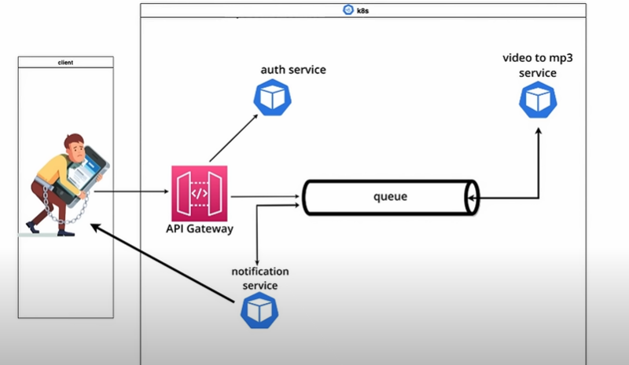

## Microservice Architecture and System Design with Python Flask & Kubernetes

A robust and scalable microservices backend built with Python, Flask, MongoDB, GridFS, MySQL, RabbitMQ, Docker, and Kubernetes which helps convert videos to audio mp3 files.

